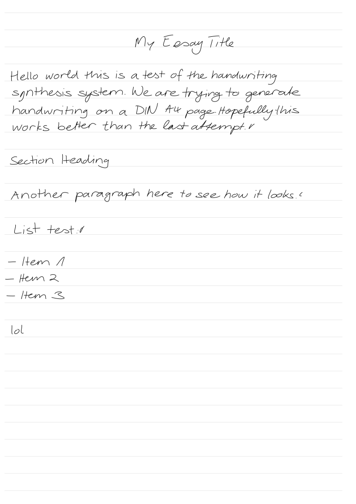
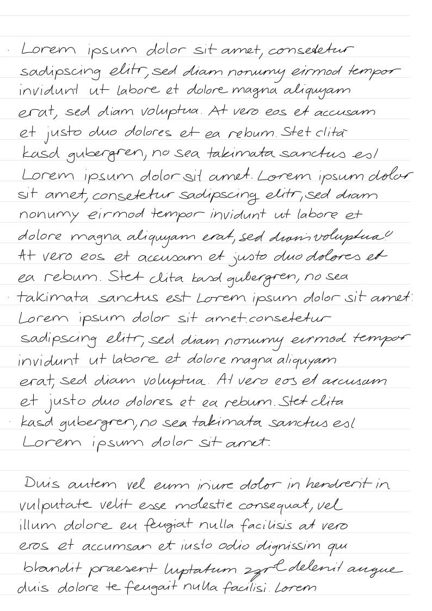
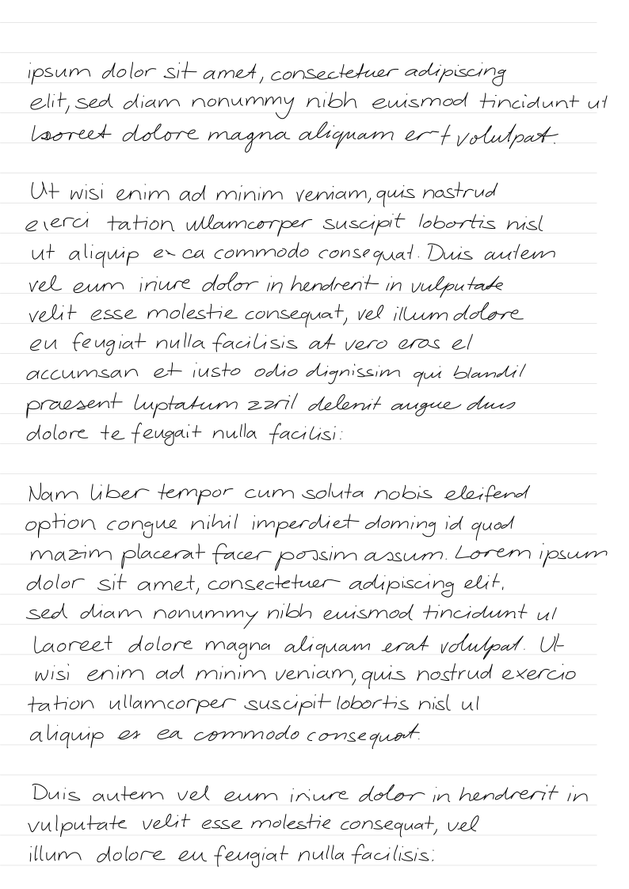
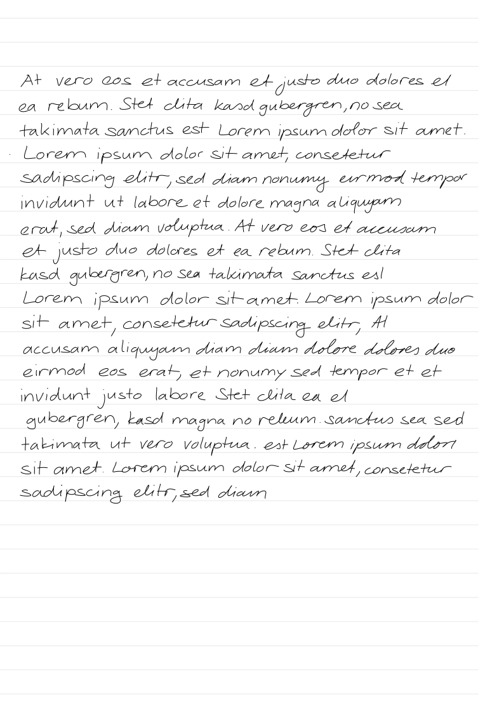
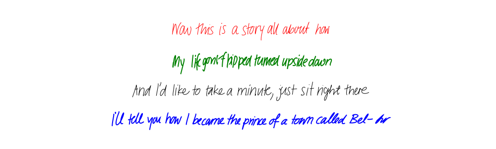

# Handwriting Synthesis


Implementation of the handwriting synthesis experiments in the paper [Generating Sequences with Recurrent Neural Networks](https://arxiv.org/abs/1308.0850) by Alex Graves.  The implementation closely follows the original paper, with a few slight deviations, and the generated samples are of similar quality to those presented in the paper.

This is a fork of CT83's fork of the original project. The main changes are better usability and ability to create essay-style handwriting with markup support (`txt2essay.py`). It also includes better documentation, as well as some code refactoring.

**All credit for training the RNN and building the model should be given to [sjvasquez](https://github.com/sjvasquez)**. This fork adds better usability features on top of that excellent foundation.

## Table of Contents

<details>
<summary>Click to expand</summary>

- [Installation](#installation)
- [Quick Start](#quick-start)
- [txt2essay - Essay Generator](#txt2essay---essay-generator)
- [Hand API - Advanced Usage](#hand-api---advanced-usage)
- [Demonstrations](#demonstrations)
- [Contribute](#contribute)

</details>

## Installation

1. Clone this repository
2. Create a virtual environment with [uv](https://docs.astral.sh/uv/) (highly recommended)

    ```cli
    uv venv --python 3.7
    ```

    Make sure to activate the virtual environment!

3. Install the requirements

    ```cli
    uv pip install -r requirements.txt
    ```

A pretrained model is included, but if you'd like to train your own, read [these instructions](https://github.com/sjvasquez/handwriting-synthesis/tree/master/data/raw).

## Quick Start

Run `demo.py` to generate handwriting samples quickly:

```bash
python demo.py
```

This will generate sample handwriting using the pretrained model.

## txt2essay - Essay Generator

Generate handwritten essays on DIN A4 pages with support for markup formatting. Perfect for creating realistic handwritten documents suitable for printing or digital use.



<details>
<summary>Show more examples</summary>





</details>

### Basic Usage

```bash
python txt2essay.py ./examples/lorem.txt
```

This will generate one or more SVG files (paginated if content is long) with your text rendered as handwriting on A4-sized pages with ruled lines.

### Supported Markup

The tool supports the following markup formats in your input text:

- **Headings:**
  - `# Heading Text` - Creates a centered heading
  - `## Heading Text` - Creates a left-aligned heading

- **Paragraph Breaks:**
  - Use double newlines (`\n\n`) to create paragraph breaks with empty lines between them

- **Lists:**
  - Unordered: `- item`, `* item`, `+ item`
  - Ordered: `1. item`, `1) item`, `a. item`, `a) item`
  - Lists are automatically detected and rendered without extra spacing between items

**Note:** Bold markers (`**text**` or `__text__`) are removed from the text as per-word styling is not supported by the handwriting API.

### Example Input

```markdown
# My Essay Title

This is the introduction paragraph. It will be wrapped
automatically to fit the page width.

## Section 1

This is a regular paragraph with multiple sentences.
The text wraps naturally.

List of items:

- First item
- Second item
- Third item

Another paragraph after the list.
```

### Configuration Parameters

You can adjust these parameters at the top of `txt2essay.py` to customize the output:

| Parameter | Default | Description |
| ----------- | --------- | ------------- |
| `FONT_SCALE` | 1.0 | Scale factor for handwriting size |
| `LINE_HEIGHT` | 38 | Vertical spacing between baselines (pixels) |
| `STROKE_WIDTH` | 1.0 | Thickness of the handwriting strokes |
| `TOP_MARGIN` | 40 | Vertical offset to align text with ruled lines |
| `LEFT_MARGIN` | 0 | Horizontal left margin (pixels) |
| `RIGHT_MARGIN` | 40 | Horizontal right margin (pixels) |
| `TEXT_WRAP_WIDTH` | 48 | Character wrap width (reduce if text overflows) |
| `RULED_LINES_COUNT` | 29 | Number of ruled lines per page |
| `ADD_RULED_LINES` | True | Enable/disable ruled lines |
| `HEADING_BIAS` | 0.7 | Bias for heading text (lower = neater) |
| `TEXT_BIAS` | 0.85 | Bias for body text |
| `TEXT_STYLE` | 7 | Handwriting style index (1-9) |

### Output

- Single page: `input.svg`
- Multiple pages: `input_page1.svg`, `input_page2.svg`, etc.
- Each page is exactly 210mm × 297mm (DIN A4)
- Pages include optional ruled lines for a notebook-like appearance

### Tips

- If text overflows the right edge, reduce `TEXT_WRAP_WIDTH` or `FONT_SCALE`
- Adjust `TOP_MARGIN` to align text baselines with ruled lines
- Lower `TEXT_BIAS` values produce neater handwriting
- Different `TEXT_STYLE` values (1-9) produce different handwriting styles

## Hand API - Advanced Usage

For more control over the handwriting generation, you can use the `Hand` class directly. Here's an example:

```python
from hand import Hand

lines = [
    "Now this is a story all about how",
    "My life got flipped turned upside down",
    "And I'd like to take a minute, just sit right there",
    "I'll tell you how I became the prince of a town called Bel-Air",
]
biases = [.75 for i in lines]
styles = [9 for i in lines]
stroke_colors = ['red', 'green', 'black', 'blue']
stroke_widths = [1, 2, 1, 2]

hand = Hand()
hand.write(
    filename='img/usage_demo.svg',
    lines=lines,
    biases=biases,
    styles=styles,
    stroke_colors=stroke_colors,
    stroke_widths=stroke_widths
)
```



Currently, the `Hand` class must be imported from `hand.py`. See `demo.py` for more examples.

## Demonstrations

Below are samples from the model demonstrating the effect of priming and biasing. Biasing controls the neatness of the samples and priming controls the style. The code for these demonstrations can be found in `ct83_demo.py`.

### Multi-Line Demo with Word Wrapping


### Demo #1

The following samples were generated with a fixed style and fixed bias.

**Smash Mouth – All Star ([lyrics](https://www.azlyrics.com/lyrics/smashmouth/allstar.html))**


### Demo #2

The following samples were generated with varying style and fixed bias.  Each verse is generated in a different style.

**Vanessa Carlton – A Thousand Miles ([lyrics](https://www.azlyrics.com/lyrics/vanessacarlton/athousandmiles.html))**


### Demo #3

The following samples were generated with a fixed style and varying bias.  Each verse has a lower bias than the previous, with the last verse being unbiased.

**Leonard Cohen – Hallelujah ([lyrics](https://www.youtube.com/watch?v=dQw4w9WgXcQ))**


## Contribute

This project was intended to serve as a reference implementation for a research paper, but since the results are of decent quality, it may be worthwile to make the project more broadly usable.  I plan to continue focusing on the machine learning side of things.  That said, I'd welcome contributors who can:

- Package this, and otherwise make it look more like a usable software project and less like research code.
- Add support for more sophisticated drawing, animations, or anything else in this direction.  Currently, the project only creates some simple svg files.
